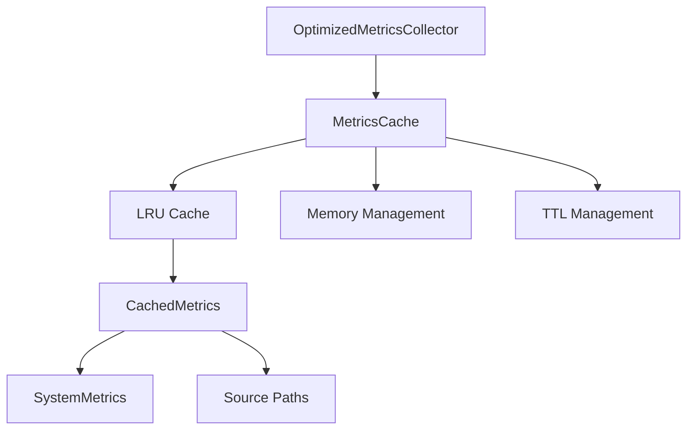

# Система кэширования SmoothTask

## Обзор

SmoothTask включает в себя комплексную систему кэширования для оптимизации сбора системных метрик и уменьшения нагрузки на систему. Система кэширования предоставляет:

- **LRU (Least Recently Used) кэш** для часто используемых метрик
- **Управление памятью** с автоматическим ограничением использования памяти
- **TTL (Time-To-Live) управление** для автоматического обновления устаревших данных
- **Graceful degradation** при ошибках кэширования
- **Параллельная обработка** с безопасным доступом к кэшу

## Архитектура

### Основные компоненты



### Ключевые структуры

#### `MetricsCacheConfig`

Конфигурация кэширования метрик:

```rust
pub struct MetricsCacheConfig {
    /// Максимальное количество кэшируемых значений
    pub max_cache_size: usize,
    
    /// Время жизни кэша в секундах
    pub cache_ttl_seconds: u64,
    
    /// Включить кэширование
    pub enable_caching: bool,
    
    /// Максимальный размер памяти для кэша в байтах (0 = без ограничения)
    pub max_memory_bytes: usize,
    
    /// Включить сжатие данных в кэше
    pub enable_compression: bool,
    
    /// Включить автоматическую очистку кэша при достижении лимитов
    pub auto_cleanup_enabled: bool,
}
```

**Значения по умолчанию:**
- `max_cache_size`: 100 элементов
- `cache_ttl_seconds`: 5 секунд
- `enable_caching`: true
- `max_memory_bytes`: 10 MB
- `enable_compression`: false
- `auto_cleanup_enabled`: true

#### `CachedMetrics`

Кэшированные системные метрики:

```rust
pub struct CachedMetrics {
    /// Временная метка создания кэша
    pub timestamp: Instant,
    
    /// Кэшированные системные метрики
    pub metrics: SystemMetrics,
    
    /// Пути к файлам, использованные для сбора метрик
    pub source_paths: HashMap<String, PathBuf>,
    
    /// Приблизительный размер в байтах
    pub approximate_size_bytes: usize,
}
```

#### `MetricsCache`

Основной кэш метрик на основе LRU:

```rust
pub struct MetricsCache {
    /// Конфигурация кэширования
    config: MetricsCacheConfig,
    
    /// LRU кэш для хранения метрик
    cache: Mutex<LruCache<String, CachedMetrics>>,
    
    /// Текущий размер кэша в байтах
    current_memory_usage: AtomicUsize,
}
```

#### `OptimizedMetricsCollector`

Оптимизированный сборщик системных метрик:

```rust
pub struct OptimizedMetricsCollector {
    /// Кэш метрик
    cache: Arc<MetricsCache>,
    
    /// Конфигурация кэширования
    config: MetricsCacheConfig,
}
```

## Функциональность

### Основные операции

#### Создание кэша

```rust
let config = MetricsCacheConfig {
    max_cache_size: 200,
    cache_ttl_seconds: 10,
    ..Default::default()
};

let cache = MetricsCache::new(config);
```

#### Получение кэшированных метрик

```rust
if let Some(cached) = cache.get("system_metrics") {
    // Используем кэшированные метрики
    println!("Using cached metrics: {:?}", cached.metrics);
} else {
    // Собираем новые метрики
    let new_metrics = collect_system_metrics();
    cache.insert("system_metrics".to_string(), new_metrics, source_paths);
}
```

#### Вставка метрик в кэш

```rust
let metrics = collect_system_metrics();
let mut source_paths = HashMap::new();
source_paths.insert("stat".to_string(), PathBuf::from("/proc/stat"));

cache.insert("system_metrics".to_string(), metrics, source_paths);
```

#### Очистка кэша

```rust
// Полная очистка кэша
cache.clear();

// Автоматическая очистка при превышении лимитов памяти
cache.cleanup_memory();
```

### Управление памятью

Система кэширования включает интеллектуальное управление памятью:

1. **Оценка размера**: Автоматическая оценка размера кэшированных данных
2. **Ограничение памяти**: Автоматическая очистка при превышении `max_memory_bytes`
3. **Приоритетная очистка**: Сначала удаляются устаревшие элементы, затем наименее используемые
4. **Атомарный счётчик**: Безопасный подсчёт использования памяти в многопоточной среде

**Алгоритм очистки:**
1. Удаляются все устаревшие элементы (превысившие TTL)
2. Если всё ещё превышен лимит, удаляются наименее используемые элементы
3. Оставляется 25% запаса для предотвращения частых очисток

### TTL управление

Каждый элемент кэша имеет временную метку и автоматически считается устаревшим после истечения TTL:

```rust
let cached = CachedMetrics::new(metrics, source_paths);
let is_expired = cached.is_expired(config.cache_ttl_seconds);
```

### Graceful Degradation

Система кэширования обеспечивает graceful degradation при ошибках:

1. **Poisoned mutex**: Автоматическое восстановление при poisoned lock
2. **Отключённое кэширование**: Продолжение работы без кэширования при отключённой функции
3. **Ошибки вставки**: Продолжение работы даже если вставка в кэш не удалась

## Интеграция с системой

### OptimizedMetricsCollector

Оптимизированный сборщик метрик предоставляет удобный интерфейс для работы с кэшированием:

```rust
let collector = OptimizedMetricsCollector::new(config);

// Сбор системных метрик с кэшированием
let metrics = collector.collect_system_metrics_cached(&paths, "system_metrics")?;

// Сбор CPU метрик с кэшированием
let cpu_times = collector.collect_cpu_metrics_cached(&cpu_path, "cpu_metrics")?;
```

### Пример использования в основном цикле

```rust
let cache_config = MetricsCacheConfig {
    max_cache_size: 500,
    cache_ttl_seconds: 30,
    max_memory_bytes: 50_000_000, // 50 MB
    ..Default::default()
};

let collector = OptimizedMetricsCollector::new(cache_config);

// В основном цикле сбора метрик
let system_metrics = collector.collect_system_metrics_cached(&proc_paths, "main_system_metrics")?;
let cpu_metrics = collector.collect_cpu_metrics_cached(&cpu_path, "main_cpu_metrics")?;
```

## Мониторинг и отладка

### Статистика кэша

```rust
let memory_info = cache.get_memory_info();
let cache_size = cache.len();
let is_empty = cache.is_empty();
let current_usage = cache.current_memory_usage();

println!("Cache stats: {}", memory_info);
println!("Cache size: {} elements", cache_size);
println!("Memory usage: {} bytes", current_usage);
```

### Логирование

Система кэширования предоставляет детальное логирование:

```
// Пример логов
DEBUG: Найдены актуальные кэшированные метрики для ключа: system_metrics
DEBUG: Собираем новые метрики для ключа: cpu_metrics
DEBUG: Сохранено в кэше: 150 элементов, память: 12345678 байт
DEBUG: Кэш для ключа system_metrics устарел (TTL: 5s), будет обновлён
DEBUG: Кэш очищен
DEBUG: Очистка кэша завершена: удалено 42 элементов, текущее использование 8765432 байт
```

## Производительность

### Преимущества кэширования

1. **Уменьшение I/O нагрузки**: Снижение количества операций чтения с диска
2. **Улучшение отзывчивости**: Быстрый доступ к часто используемым метрикам
3. **Снижение CPU нагрузки**: Уменьшение количества операций парсинга
4. **Предсказуемая производительность**: Стабильное время отклика независимо от системной нагрузки

### Рекомендации по настройке

| Параметр | Рекомендуемое значение | Описание |
|----------|----------------------|-----------|
| `max_cache_size` | 100-500 | Количество элементов в кэше |
| `cache_ttl_seconds` | 5-30 | Время жизни кэша в секундах |
| `max_memory_bytes` | 10-100 MB | Максимальный размер памяти для кэша |
| `enable_caching` | true | Включить кэширование |
| `auto_cleanup_enabled` | true | Автоматическая очистка кэша |

### Настройка для разных сценариев

**Сценарий 1: Высоконагруженная система**
- `max_cache_size`: 500
- `cache_ttl_seconds`: 10
- `max_memory_bytes`: 100_000_000 (100 MB)
- `auto_cleanup_enabled`: true

**Сценарий 2: Низкоресурсная система**
- `max_cache_size`: 100
- `cache_ttl_seconds`: 5
- `max_memory_bytes`: 10_000_000 (10 MB)
- `auto_cleanup_enabled`: true

**Сценарий 3: Тестирование/отладка**
- `max_cache_size`: 50
- `cache_ttl_seconds`: 2
- `max_memory_bytes`: 5_000_000 (5 MB)
- `enable_caching`: false (для отладки без кэширования)

## Тестирование

Система кэширования включает комплексные тесты:

```rust
#[cfg(test)]
mod tests {
    use super::*;
    use std::thread;
    use std::time::Duration;

    #[test]
    fn test_cache_insert_and_get() {
        let config = MetricsCacheConfig::default();
        let cache = MetricsCache::new(config);
        
        let metrics = SystemMetrics::default();
        let mut source_paths = HashMap::new();
        source_paths.insert("test".to_string(), PathBuf::from("/test"));
        
        cache.insert("test_key".to_string(), metrics.clone(), source_paths);
        
        let cached = cache.get("test_key");
        assert!(cached.is_some());
        assert_eq!(cached.unwrap().metrics, metrics);
    }

    #[test]
    fn test_cache_ttl_expiration() {
        let mut config = MetricsCacheConfig::default();
        config.cache_ttl_seconds = 1; // 1 секунда
        
        let cache = MetricsCache::new(config);
        let metrics = SystemMetrics::default();
        let mut source_paths = HashMap::new();
        
        cache.insert("test_key".to_string(), metrics, source_paths);
        
        // Сначала кэш должен быть доступен
        assert!(cache.get("test_key").is_some());
        
        // Ждём 2 секунды
        thread::sleep(Duration::from_secs(2));
        
        // Теперь кэш должен быть устаревшим
        assert!(cache.get("test_key").is_none());
    }

    #[test]
    fn test_cache_memory_cleanup() {
        let mut config = MetricsCacheConfig::default();
        config.max_memory_bytes = 1000; // 1000 байт
        config.auto_cleanup_enabled = true;
        
        let cache = MetricsCache::new(config);
        
        // Вставляем много данных, чтобы превысить лимит
        for i in 0..10 {
            let metrics = SystemMetrics::default();
            let mut source_paths = HashMap::new();
            source_paths.insert(format!("key_{}", i), PathBuf::from(format!("/test_{}", i)));
            
            cache.insert(format!("key_{}", i), metrics, source_paths);
        }
        
        // Проверяем, что кэш не превышает лимит памяти
        let usage = cache.current_memory_usage();
        assert!(usage <= 1000);
    }
}
```

## Ошибки и восстановление

### Обработка ошибок

1. **Poisoned mutex**: Автоматическое восстановление и очистка кэша
2. **Превышение лимитов**: Автоматическая очистка и продолжение работы
3. **Ошибки вставки**: Graceful degradation без прерывания основного потока
4. **Ошибки конфигурации**: Использование значений по умолчанию

### Рекомендации по устранению проблем

| Проблема | Возможная причина | Решение |
|----------|-------------------|---------|
| Кэш не используется | `enable_caching` = false | Включить кэширование в конфигурации |
| Частые очистки кэша | Слишком маленький `max_memory_bytes` | Увеличить лимит памяти |
| Устаревшие данные | Слишком большое `cache_ttl_seconds` | Уменьшить TTL |
| Высокая нагрузка на память | Слишком большое `max_cache_size` | Уменьшить размер кэша |
| Poisoned mutex | Конкурентный доступ без синхронизации | Проверить код на правильное использование блокировок |

## Будущие улучшения

1. **Сжатие данных**: Добавление поддержки сжатия для экономии памяти
2. **Персистентный кэш**: Сохранение кэша на диск для быстрого восстановления
3. **Мультиуровневое кэширование**: Добавление L1/L2 кэша для разных типов данных
4. **Адаптивное TTL**: Автоматическая настройка TTL в зависимости от системной нагрузки
5. **Распределённый кэш**: Поддержка распределённого кэширования для кластерных систем

## Заключение

Система кэширования SmoothTask предоставляет мощный инструмент для оптимизации сбора системных метрик. Она обеспечивает:

- **Высокую производительность** за счёт уменьшения I/O операций
- **Надёжность** благодаря graceful degradation и обработке ошибок
- **Гибкость** через настраиваемые параметры кэширования
- **Безопасность** с помощью атомарных операций и правильного управления памятью

Рекомендуется использовать кэширование во всех производственных сценариях для улучшения производительности и снижения нагрузки на систему.