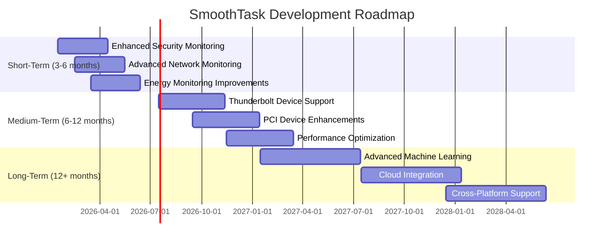

# Future Roadmap for SmoothTask

## Overview

This document outlines the future development roadmap for SmoothTask, including planned features, improvements, and long-term goals.

## Short-Term Goals (Next 3-6 Months)

### 1. Enhanced Security Monitoring
- **ST-1062**: Improve threat detection algorithms
  - Add machine learning-based anomaly detection
  - Implement behavioral analysis for process monitoring
  - Enhance network traffic analysis

- **ST-1063**: Expand threat database
  - Add more threat signatures and patterns
  - Implement automatic threat database updates
  - Add community-contributed threat patterns

### 2. Advanced Network Monitoring
- **ST-1064**: Implement deep packet inspection
  - Add protocol-level analysis
  - Implement traffic shaping and QoS
  - Add network anomaly detection

- **ST-1065**: Enhance network security
  - Add intrusion detection system (IDS)
  - Implement network behavior analysis
  - Add automated threat response

### 3. Energy Monitoring Improvements
- **ST-1066**: Add support for additional power sensors
  - Implement Intel RAPL support
  - Add AMD power monitoring
  - Support additional hardware sensors

- **ST-1067**: Improve energy efficiency analysis
  - Add process-level energy monitoring
  - Implement energy efficiency recommendations
  - Add power consumption forecasting

## Medium-Term Goals (6-12 Months)

### 1. Thunderbolt Device Support
- **ST-1068**: Add Thunderbolt device detection
  - Implement Thunderbolt controller detection
  - Add Thunderbolt device monitoring
  - Implement security monitoring for Thunderbolt devices

### 2. PCI Device Enhancements
- **ST-1069**: Implement automatic PCI device classification
  - Add detailed PCI device information
  - Implement PCI device health monitoring
  - Add PCI device performance metrics

### 3. Performance Optimization
- **ST-1070**: Implement adaptive monitoring
  - Add dynamic sampling rates
  - Implement intelligent resource allocation
  - Add workload-based monitoring adjustments

## Long-Term Goals (12+ Months)

### 1. Advanced Machine Learning
- **ST-1071**: Implement ML-based predictive monitoring
  - Add anomaly prediction
  - Implement failure prediction
  - Add automated optimization recommendations

### 2. Cloud Integration
- **ST-1072**: Add cloud monitoring support
  - Implement AWS monitoring
  - Add Azure monitoring
  - Implement Google Cloud monitoring

### 3. Cross-Platform Support
- **ST-1073**: Expand platform support
  - Add Windows support (experimental)
  - Implement macOS support
  - Add BSD support

## Technical Improvements

### 1. Architecture Enhancements
- **ST-1074**: Improve modular architecture
  - Enhance plugin system
  - Implement better dependency management
  - Add dynamic module loading

### 2. Performance Optimization
- **ST-1075**: Implement advanced caching
  - Add multi-level caching
  - Implement cache invalidation strategies
  - Add cache performance monitoring

### 3. Testing and Quality
- **ST-1076**: Enhance testing framework
  - Add integration testing
  - Implement performance testing
  - Add security testing

## Community and Ecosystem

### 1. Community Features
- **ST-1077**: Add community contributions
  - Implement plugin marketplace
  - Add community pattern sharing
  - Implement user-contributed metrics

### 2. Documentation Improvements
- **ST-1078**: Enhance documentation
  - Add interactive tutorials
  - Implement API documentation
  - Add video tutorials

### 3. Developer Experience
- **ST-1079**: Improve developer tools
  - Add IDE integration
  - Implement debugging tools
  - Add development environment setup

## Roadmap Timeline

## Prioritization

### High Priority
- Security monitoring enhancements
- Network monitoring improvements
- Performance optimization
- Bug fixes and stability improvements

### Medium Priority
- Thunderbolt device support
- PCI device enhancements
- Energy monitoring improvements
- Documentation updates

### Low Priority
- Cloud integration
- Cross-platform support
- Advanced machine learning features

## Success Metrics

### Short-Term Success
- 95% test coverage for new features
- No critical bugs in production
- Positive user feedback on new features
- Improved performance metrics

### Long-Term Success
- Increased adoption and user base
- Positive community engagement
- Regular contributions from community
- Stable and reliable monitoring system
- Comprehensive feature set

## Risks and Mitigation

### Technical Risks
- **Complexity**: Increasing complexity of the codebase
  - Mitigation: Regular code reviews and refactoring
- **Performance**: Performance degradation with new features
  - Mitigation: Continuous performance monitoring and optimization
- **Compatibility**: Breaking changes in dependencies
  - Mitigation: Regular dependency updates and testing

### Resource Risks
- **Time**: Limited development time
  - Mitigation: Prioritize high-impact features
- **Expertise**: Limited expertise in certain areas
  - Mitigation: Community contributions and collaboration
- **Funding**: Limited funding for development
  - Mitigation: Open source community support

## Conclusion

This roadmap provides a comprehensive plan for the future development of SmoothTask. The roadmap is designed to be flexible and adaptable to changing requirements and priorities. Regular reviews and updates will ensure that the project continues to meet the needs of its users and community.