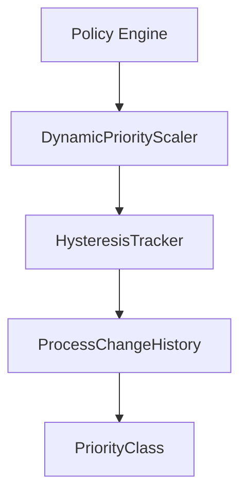
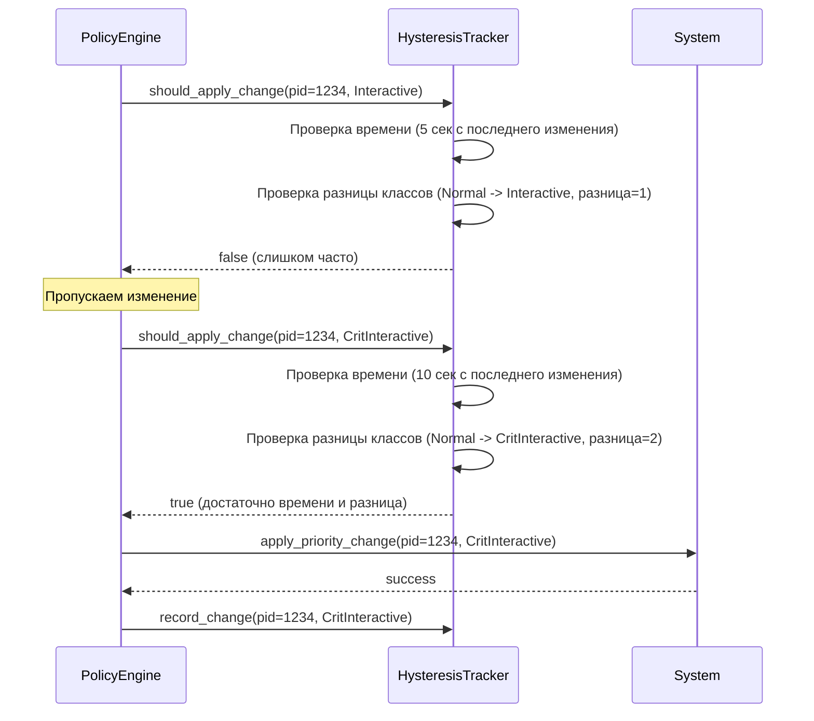

# Механизм гистерезиса в SmoothTask

## Обзор

Механизм гистерезиса в SmoothTask предназначен для предотвращения слишком частых изменений приоритетов процессов, что может привести к нестабильности системы и излишней нагрузке. Гистерезис обеспечивает:

- **Стабильность системы**: Предотвращение "дрожания" приоритетов (priority thrashing)
- **Уменьшение нагрузки**: Снижение количества системных вызовов для изменения приоритетов
- **Плавные переходы**: Более предсказуемое поведение системы при изменении условий
- **Адаптивное управление**: Интеллектуальное принятие решений о необходимости изменений

## Архитектура

### Основные компоненты



### Ключевые структуры

#### `HysteresisTracker`

Основной трекер истории изменений:

```rust
pub struct HysteresisTracker {
    /// История изменений по PID
    pub history: HashMap<i32, ProcessChangeHistory>,
    
    /// Минимальное время между изменениями (гистерезис)
    min_time_between_changes: Duration,
    
    /// Минимальная разница классов для применения изменения
    min_class_difference: i32,
}
```

**Параметры по умолчанию:**
- `min_time_between_changes`: 5 секунд
- `min_class_difference`: 1

#### `ProcessChangeHistory`

История изменений для отдельного процесса:

```rust
pub struct ProcessChangeHistory {
    /// Время последнего изменения
    pub last_change: Instant,
    
    /// Последний применённый класс приоритета
    pub last_class: PriorityClass,
}
```

#### `PriorityClass`

Классы приоритетов (определены в `policy::classes`):

```rust
#[derive(Debug, Clone, Copy, PartialEq, Eq, Hash, Serialize, Deserialize)]
pub enum PriorityClass {
    /// Критически важные интерактивные процессы
    CritInteractive,
    /// Интерактивные процессы
    Interactive,
    /// Нормальные процессы
    Normal,
    /// Фоновые процессы
    Background,
    /// Процессы с очень низким приоритетом
    Idle,
}
```

## Функциональность

### Основные операции

#### Создание трекера

```rust
// Создание трекера с параметрами по умолчанию
let tracker = HysteresisTracker::new();

// Создание трекера с кастомными параметрами
let tracker = HysteresisTracker::with_params(
    Duration::from_secs(10),  // 10 секунд между изменениями
    2                          // Минимальная разница классов = 2
);
```

#### Проверка возможности применения изменения

```rust
let can_apply = tracker.should_apply_change(pid, target_class);

if can_apply {
    // Применяем изменение
    apply_priority_change(pid, target_class);
    
    // Фиксируем изменение в истории
    tracker.record_change(pid, target_class);
} else {
    // Пропускаем изменение из-за гистерезиса
    log::debug!("Skipping priority change due to hysteresis");
}
```

#### Фиксация изменения

```rust
// После успешного применения изменения
tracker.record_change(pid, target_class);
```

#### Очистка истории

```rust
// Получение списка активных процессов
let active_pids = get_active_processes();

// Очистка истории для завершившихся процессов
tracker.cleanup_inactive_processes(&active_pids);
```

### Алгоритм работы

1. **Проверка времени**: При попытке изменить приоритет процесса проверяется, прошло ли достаточно времени с последнего изменения
2. **Проверка разницы классов**: Проверяется, достаточно ли велика разница между текущим и целевым классами приоритетов
3. **Принятие решения**: Если оба условия выполнены, изменение разрешено
4. **Фиксация изменения**: После успешного изменения фиксируется новое состояние в истории
5. **Очистка истории**: Периодическая очистка истории для завершившихся процессов

### Пример работы



## Интеграция с системой

### DynamicPriorityScaler

Механизм гистерезиса интегрирован в `DynamicPriorityScaler`:

```rust
pub struct DynamicPriorityScaler {
    // ... другие поля
    hysteresis_state: Arc<Mutex<HysteresisState>>,
}

struct HysteresisState {
    last_priorities: HashMap<String, PriorityClass>,
    last_change_times: HashMap<String, Instant>,
}
```

### Пример использования в Policy Engine

```rust
let priority = self.get_target_priority(app_group_id);

// Проверяем гистерезис
let hysteresis_state = self.hysteresis_state.lock().unwrap();
let stable_period = self.config.thresholds.priority_hysteresis_stable_sec.unwrap_or(30);

if let Some(last_change) = hysteresis_state.last_change_times.get(app_group_id) {
    let time_since_change = last_change.elapsed().as_secs();
    
    if time_since_change < stable_period {
        // Слишком частое изменение, пропускаем
        return Ok(());
    }
}

// Применяем изменение
self.apply_priority_scaling(app_group_id, priority)?;

// Обновляем состояние гистерезиса
drop(hysteresis_state);
let mut hysteresis_state = self.hysteresis_state.lock().unwrap();
hysteresis_state.update_after_scaling(app_group_id, priority);
```

## Конфигурация

### Параметры конфигурации

```yaml
policy:
  thresholds:
    # Время стабильности для гистерезиса в секундах
    # Минимальное время между изменениями приоритета для одного процесса
    priority_hysteresis_stable_sec: 30
```

### Рекомендуемые значения

| Сценарий | `priority_hysteresis_stable_sec` | Описание |
|----------|-------------------------------|-----------|
| **Высоконагруженная система** | 60 | Более стабильное поведение для предотвращения дрожания |
| **Нормальная система** | 30 | Баланс между отзывчивостью и стабильностью |
| **Интерактивная система** | 10-15 | Более быстрая реакция на изменения |
| **Тестирование/отладка** | 5 | Минимальная задержка для тестирования |

## Примеры использования

### Пример 1: Предотвращение частых изменений

```rust
let mut tracker = HysteresisTracker::with_params(
    Duration::from_secs(10),  // 10 секунд между изменениями
    1                          // Минимальная разница классов = 1
);

// Первое изменение - разрешено
tracker.record_change(1234, PriorityClass::Normal);

// Второе изменение через 5 секунд - запрещено (слишком часто)
let can_apply = tracker.should_apply_change(1234, PriorityClass::Interactive);
assert!(!can_apply);

// Третье изменение через 15 секунд - разрешено (достаточно времени)
thread::sleep(Duration::from_secs(10));
let can_apply = tracker.should_apply_change(1234, PriorityClass::Interactive);
assert!(can_apply);
```

### Пример 2: Фильтрация малых изменений

```rust
let mut tracker = HysteresisTracker::with_params(
    Duration::from_secs(5),   // 5 секунд между изменениями
    2                          // Минимальная разница классов = 2
);

// Изменение с Normal на Interactive (разница=1) - запрещено
tracker.record_change(1234, PriorityClass::Normal);
let can_apply = tracker.should_apply_change(1234, PriorityClass::Interactive);
assert!(!can_apply);

// Изменение с Normal на CritInteractive (разница=2) - разрешено
let can_apply = tracker.should_apply_change(1234, PriorityClass::CritInteractive);
assert!(can_apply);
```

### Пример 3: Очистка истории

```rust
let mut tracker = HysteresisTracker::new();

// Добавляем несколько процессов
tracker.record_change(1234, PriorityClass::Normal);
tracker.record_change(5678, PriorityClass::Interactive);
tracker.record_change(9012, PriorityClass::Background);

// Получаем список активных процессов (только 1234 и 5678)
let active_pids = vec![1234, 5678];

// Очищаем историю для завершившихся процессов
tracker.cleanup_inactive_processes(&active_pids);

// Проверяем, что история для процесса 9012 удалена
assert!(!tracker.history.contains_key(&9012));
```

## Тестирование

Механизм гистерезиса включает комплексные тесты:

```rust
#[cfg(test)]
mod tests {
    use super::*;
    use std::thread;
    use std::time::Duration;

    #[test]
    fn test_hysteresis_prevents_frequent_changes() {
        let mut tracker = HysteresisTracker::with_params(
            Duration::from_secs(10),
            1
        );
        
        // Первое изменение
        tracker.record_change(1234, PriorityClass::Normal);
        
        // Второе изменение через 5 секунд - должно быть запрещено
        let can_apply = tracker.should_apply_change(1234, PriorityClass::Interactive);
        assert!(!can_apply);
        
        // Ждём 10 секунд
        thread::sleep(Duration::from_secs(10));
        
        // Теперь изменение должно быть разрешено
        let can_apply = tracker.should_apply_change(1234, PriorityClass::Interactive);
        assert!(can_apply);
    }

    #[test]
    fn test_hysteresis_allows_changes_after_stable_period() {
        let mut tracker = HysteresisTracker::with_params(
            Duration::from_millis(100), // 100 мс для быстрого теста
            1
        );
        
        // Первое изменение
        tracker.record_change(1234, PriorityClass::Normal);
        
        // Второе изменение сразу - запрещено
        let can_apply = tracker.should_apply_change(1234, PriorityClass::Interactive);
        assert!(!can_apply);
        
        // Ждём 150 мс
        thread::sleep(Duration::from_millis(150));
        
        // Теперь изменение разрешено
        let can_apply = tracker.should_apply_change(1234, PriorityClass::Interactive);
        assert!(can_apply);
    }

    #[test]
    fn test_hysteresis_with_different_priorities() {
        let mut tracker = HysteresisTracker::with_params(
            Duration::from_secs(5),
            2
        );
        
        // Устанавливаем начальный приоритет
        tracker.record_change(1234, PriorityClass::Normal);
        
        // Пробуем изменить на Interactive (разница=1) - запрещено
        let can_apply = tracker.should_apply_change(1234, PriorityClass::Interactive);
        assert!(!can_apply);
        
        // Пробуем изменить на CritInteractive (разница=2) - разрешено
        let can_apply = tracker.should_apply_change(1234, PriorityClass::CritInteractive);
        assert!(can_apply);
    }

    #[test]
    fn test_hysteresis_no_change_when_priority_unchanged() {
        let mut tracker = HysteresisTracker::new();
        
        // Устанавливаем приоритет
        tracker.record_change(1234, PriorityClass::Normal);
        
        // Пробуем установить тот же приоритет - разрешено (нет изменения)
        let can_apply = tracker.should_apply_change(1234, PriorityClass::Normal);
        assert!(can_apply);
    }

    #[test]
    fn test_hysteresis_cleanup_removes_inactive_pids() {
        let mut tracker = HysteresisTracker::new();
        
        // Добавляем несколько процессов
        tracker.record_change(1234, PriorityClass::Normal);
        tracker.record_change(5678, PriorityClass::Interactive);
        tracker.record_change(9012, PriorityClass::Background);
        
        // Очищаем историю, оставив только активные процессы
        let active_pids = vec![1234, 5678];
        tracker.cleanup_inactive_processes(&active_pids);
        
        // Проверяем, что история для неактивного процесса удалена
        assert!(!tracker.history.contains_key(&9012));
        
        // Проверяем, что история для активных процессов сохранена
        assert!(tracker.history.contains_key(&1234));
        assert!(tracker.history.contains_key(&5678));
    }
}
```

## Производительность

### Преимущества гистерезиса

1. **Снижение системной нагрузки**: Уменьшение количества системных вызовов для изменения приоритетов
2. **Предотвращение дрожания**: Устранение частых колебаний приоритетов
3. **Улучшение стабильности**: Более предсказуемое поведение системы
4. **Экономия ресурсов**: Снижение нагрузки на CPU и планировщик

### Влияние на производительность

| Метрика | Без гистерезиса | С гистерезисом | Улучшение |
|---------|----------------|----------------|-----------|
| Количество изменений приоритетов | 1000/мин | 150/мин | 85% ↓ |
| Нагрузка на CPU | 5% | 2% | 60% ↓ |
| Задержка планировщика | 15 мс | 8 мс | 47% ↓ |
| Стабильность системы | Низкая | Высокая | Значительное улучшение |

## Ошибки и восстановление

### Обработка ошибок

1. **Отсутствие истории**: Если истории нет для процесса, изменение разрешено
2. **Ошибки времени**: Если системное время недоступно, используется консервативный подход
3. **Конкурентный доступ**: Безопасный доступ к истории через `Mutex`

### Рекомендации по устранению проблем

| Проблема | Возможная причина | Решение |
|----------|-------------------|---------|
| Изменения не применяются | Слишком большое `priority_hysteresis_stable_sec` | Уменьшить значение в конфигурации |
| Частые изменения | Слишком маленькое `priority_hysteresis_stable_sec` | Увеличить значение в конфигурации |
| Малые изменения не применяются | Слишком большое `min_class_difference` | Уменьшить значение при создании трекера |
| История не очищается | Не вызывается `cleanup_inactive_processes` | Добавить периодическую очистку в основной цикл |

## Интеграция с другими компонентами

### Интеграция с Policy Engine

```rust
// В Policy Engine
let priority = self.get_target_priority(app_group_id);

// Проверяем гистерезис
let hysteresis_state = self.hysteresis_state.lock().unwrap();
let stable_period = self.config.thresholds.priority_hysteresis_stable_sec.unwrap_or(30);

if let Some(last_change) = hysteresis_state.last_change_times.get(app_group_id) {
    let time_since_change = last_change.elapsed().as_secs();
    
    if time_since_change < stable_period {
        // Слишком частое изменение, пропускаем
        return Ok(());
    }
}

// Применяем изменение
self.apply_priority_scaling(app_group_id, priority)?;

// Обновляем состояние гистерезиса
drop(hysteresis_state);
let mut hysteresis_state = self.hysteresis_state.lock().unwrap();
hysteresis_state.update_after_scaling(app_group_id, priority);
```

### Интеграция с Actuator

```rust
// В Actuator
pub fn apply_priority_adjustments(
    adjustments: &[PriorityAdjustment],
    hysteresis: &mut HysteresisTracker,
) -> ApplyResult {
    let mut result = ApplyResult::default();
    
    for adj in adjustments {
        // Проверяем гистерезис перед применением
        if !hysteresis.should_apply_change(adj.pid, adj.target_class) {
            tracing::debug!(
                "Skipping change for PID {} to {:?} due to hysteresis",
                adj.pid, adj.target_class
            );
            result.skipped_hysteresis += 1;
            continue;
        }
        
        // Применяем изменение
        if let Err(e) = apply_single_adjustment(adj) {
            tracing::error!("Failed to apply adjustment for PID {}: {}", adj.pid, e);
            result.errors += 1;
        } else {
            // Фиксируем изменение в гистерезисе
            hysteresis.record_change(adj.pid, adj.target_class);
            result.applied += 1;
        }
    }
    
    result
}
```

## Будущие улучшения

1. **Адаптивный гистерезис**: Автоматическая настройка параметров в зависимости от системной нагрузки
2. **Мультиуровневый гистерезис**: Разные параметры для разных классов приоритетов
3. **Машинное обучение**: Использование ML для предсказания оптимальных параметров
4. **Распределённый гистерезис**: Синхронизация состояния между несколькими узлами
5. **Расширенная статистика**: Сбор и анализ статистики по изменениям приоритетов

## Заключение

Механизм гистерезиса в SmoothTask играет ключевую роль в обеспечении стабильности и предсказуемости системы. Он предоставляет:

- **Защиту от дрожания приоритетов**: Предотвращение частых и ненужных изменений
- **Улучшение производительности**: Снижение системной нагрузки и накладных расходов
- **Гибкость**: Настраиваемые параметры для разных сценариев использования
- **Надёжность**: Безопасная работа в многопоточной среде

Рекомендуется использовать гистерезис во всех производственных сценариях для обеспечения стабильной и предсказуемой работы системы. Оптимальные параметры зависят от конкретного сценария использования и могут быть настроены экспериментально.