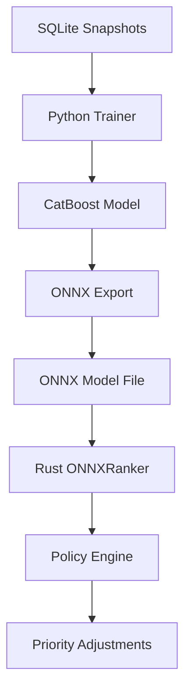

# Интеграция ONNX моделей в SmoothTask

## Обзор

Этот документ описывает процесс интеграции ONNX моделей в SmoothTask для ранжирования групп приложений. ONNX (Open Neural Network Exchange) предоставляет стандартный формат для обмена ML-моделями между различными фреймворками.

## Компоненты ONNX интеграции

### 1. Архитектура компонентов



### 2. Ключевые модули

- **`smoothtask-trainer`**: Python-библиотека для обучения CatBoost моделей и экспорта в ONNX
- **`smoothtask-core::model::onnx_ranker`**: Rust-реализация ONNX ранкера
- **`smoothtask-core::policy::engine`**: Интеграция ONNX ранкера в движок политик

## Процесс обучения и экспорта

### 1. Подготовка данных

Перед обучением необходимо собрать данные о работе системы:

```bash
# Запустить демон SmoothTask для сбора снапшотов
cargo run --bin smoothtaskd -- --config configs/smoothtask.example.yml

# Просмотреть собранные данные
sqlite3 snapshots.db "SELECT COUNT(*) FROM snapshots;"
```

### 2. Обучение модели

Используйте `train_ranker.py` для обучения CatBoost модели:

```bash
cd smoothtask-trainer
python -m smoothtask_trainer.train_ranker \
    --db snapshots.db \
    --model-json models/ranker.json \
    --model-onnx models/ranker.onnx
```

**Параметры обучения:**
- `loss_function`: YetiRank (оптимизирован для ранжирования)
- `depth`: 6 (глубина деревьев)
- `learning_rate`: 0.1
- `iterations`: 500

### 3. Экспорт модели в ONNX

Модель автоматически экспортируется в ONNX формат при обучении. Также можно экспортировать существующую модель:

```bash
python -m smoothtask_trainer.export_model \
    --model-path models/ranker.json \
    --format onnx \
    --output-path models/ranker.onnx
```

## Конфигурация ONNX ранкера

### 1. Базовая конфигурация

В файле конфигурации `smoothtask.yml`:

```yaml
model:
  # Путь к ONNX модели
  model_path: "models/ranker.onnx"
  
  # Включение ONNX ранкера
  enabled: true

policy:
  # Режим работы: hybrid (использует ONNX + правила)
  mode: "hybrid"
```

### 2. Примеры конфигураций

#### Пример 1: Только ONNX ранкер

```yaml
model:
  model_path: "models/ranker.onnx"
  enabled: true

policy:
  mode: "ml_only"  # Использует только ML-модель
```

#### Пример 2: Гибридный режим (ONNX + правила)

```yaml
model:
  model_path: "models/ranker.onnx"
  enabled: true

policy:
  mode: "hybrid"  # Использует ONNX + правила
  rule_weights:
    ml: 0.7
    rules: 0.3
```

#### Пример 3: Отключение ONNX

```yaml
model:
  enabled: false

policy:
  mode: "rules_only"  # Использует только правила
```

## Интеграция в Rust

### 1. Загрузка ONNX модели

```rust
use smoothtask_core::model::onnx_ranker::ONNXRanker;

// Загрузка модели
let ranker = ONNXRanker::load("models/ranker.onnx")
    .expect("Failed to load ONNX model");
```

### 2. Использование ONNX ранкера

```rust
use smoothtask_core::model::ranker::Ranker;
use smoothtask_core::logging::snapshots::{Snapshot, AppGroupRecord};

// Создание снапшота и групп приложений
let snapshot: Snapshot = /* ... */;
let app_groups: Vec<AppGroupRecord> = /* ... */;

// Ранжирование групп
let results = ranker.rank(&app_groups, &snapshot);

// Обработка результатов
for (app_group_id, result) in &results {
    println!("Group {}: score={:.2}, rank={}", 
             app_group_id, result.score, result.rank);
}
```

### 3. Интеграция в Policy Engine

```rust
use smoothtask_core::policy::engine::PolicyEngine;
use smoothtask_core::config::config_struct::Config;

// Загрузка конфигурации
let config = Config::load("smoothtask.yml")?;

// Создание движка политик с ONNX ранкером
let mut engine = PolicyEngine::new(&config)?;

// Вычисление приоритетов
let priorities = engine.calculate_priorities(&snapshot, &app_groups)?;
```

## Обработка ошибок

### 1. Ошибки загрузки модели

```rust
match ONNXRanker::load("models/ranker.onnx") {
    Ok(ranker) => {
        // Успешная загрузка
    }
    Err(e) => {
        eprintln!("Failed to load ONNX model: {}", e);
        // Fallback на заглушку
        let ranker = StubRanker::new();
    }
}
```

### 2. Ошибки выполнения

```rust
match ranker.rank(&app_groups, &snapshot) {
    Ok(results) => {
        // Успешное ранжирование
    }
    Err(e) => {
        eprintln!("Failed to rank app groups: {}", e);
        // Fallback на правила
        let results = rule_based_ranking(&app_groups);
    }
}
```

## Тестирование ONNX интеграции

### 1. Unit тесты

```bash
# Запуск unit тестов для ONNX ранкера
cargo test --lib model::onnx_ranker
```

### 2. Интеграционные тесты

```bash
# Запуск интеграционных тестов
cargo test --test actuator_integration_test
```

### 3. Тестирование с мок-моделью

```rust
#[test]
fn test_onnx_ranker_with_mock_model() {
    // Создание временной ONNX модели
    let temp_file = tempfile::NamedTempFile::new();
    let model_path = temp_file.path();
    
    // Создание заглушки ONNX модели
    std::fs::write(model_path, "dummy_onnx_content").unwrap();
    
    // Тестирование загрузки
    let result = ONNXRanker::load(model_path);
    assert!(result.is_err()); // Ожидаем ошибку для невалидной модели
}
```

## Troubleshooting

### 1. Ошибки загрузки ONNX модели

**Проблема:** `Failed to load ONNX model: File not found`

**Решение:**
- Убедитесь, что путь к модели указан правильно
- Проверьте, что файл существует: `ls -la models/ranker.onnx`
- Используйте абсолютные пути или правильные относительные пути

**Проблема:** `Invalid ONNX model format`

**Решение:**
- Убедитесь, что модель экспортирована правильно
- Проверьте версию ONNX Runtime: `cargo tree | grep ort`
- Переэкспортируйте модель: `python -m smoothtask_trainer.export_model ...`

### 2. Ошибки выполнения модели

**Проблема:** `Shape mismatch in ONNX model`

**Решение:**
- Проверьте, что количество фич совпадает с ожидаемым
- Обновите модель с правильными данными
- Проверьте логи обучения на наличие предупреждений

**Проблема:** `ONNX Runtime error during inference`

**Решение:**
- Проверьте совместимость версии ONNX Runtime
- Обновите зависимости: `cargo update -p ort`
- Проверьте системные зависимости (CUDA, если используется)

### 3. Производительность

**Проблема:** Медленное выполнение ONNX модели

**Решение:**
- Уменьшите размер модели (уменьшите depth, iterations)
- Используйте квантизацию модели
- Проверьте нагрузку на CPU/GPU

## Лучшие практики

### 1. Управление моделями

- Храните модели в системе контроля версий
- Используйте семантическое версионирование для моделей
- Документируйте изменения в моделях

### 2. Мониторинг

- Логируйте ошибки загрузки и выполнения моделей
- Мониторьте производительность модели
- Отслеживайте метрики качества ранжирования

### 3. Обновление моделей

- Тестируйте новые модели перед развертыванием
- Используйте A/B тестирование для сравнения моделей
- Плавно переходите на новые модели

## Примеры использования

### 1. Полный цикл обучения и развертывания

```bash
# 1. Сбор данных
cargo run --bin smoothtaskd -- --config configs/smoothtask.example.yml

# 2. Обучение модели
cd smoothtask-trainer
python -m smoothtask_trainer.train_ranker \
    --db snapshots.db \
    --model-json models/ranker.json \
    --model-onnx models/ranker.onnx

# 3. Развертывание модели
# Обновите конфигурацию smoothtask.yml
# Перезапустите демон
cargo run --bin smoothtaskd -- --config configs/smoothtask.example.yml
```

### 2. Обновление существующей модели

```bash
# 1. Экспорт существующей модели в ONNX
python -m smoothtask_trainer.export_model \
    --model-path models/ranker.json \
    --format onnx \
    --output-path models/ranker_v2.onnx

# 2. Тестирование новой модели
# Обновите конфигурацию для использования новой модели
# Проверьте логи на наличие ошибок

# 3. Развертывание
# Замените старую модель на новую
mv models/ranker_v2.onnx models/ranker.onnx
```

### 3. Отладка проблем с моделью

```bash
# 1. Проверка модели
python -c "
import onnx
model = onnx.load('models/ranker.onnx')
print('Model inputs:', [input.name for input in model.graph.input])
print('Model outputs:', [output.name for output in model.graph.output])
"

# 2. Проверка совместимости
cargo test --lib model::onnx_ranker::tests

# 3. Проверка интеграции
cargo test --lib policy::engine::tests
```

## Ссылки

- [ONNX Official Documentation](https://onnx.ai/)
- [ONNX Runtime Documentation](https://onnxruntime.ai/)
- [CatBoost ONNX Export](https://catboost.readthedocs.io/en/latest/onnx.html)
- [SmoothTask ML Classification](ML_CLASSIFICATION.md)
- [SmoothTask Architecture](ARCHITECTURE.md)